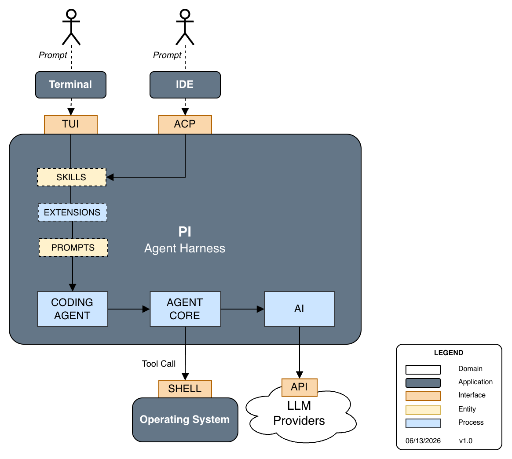

# Pi Extensions

A collection of [pi](https://github.com/earendil-works/pi-coding-agent) extensions that add interactive TUI overlays and productivity tools to your AI coding sessions.



## Extensions

| Extension | Command | Description |
|-----------|---------|-------------|
| [Form](docs/form-extension.md) | `/form <file.json>` | Render any interactive form from a JSON definition file |
| [Spring Initializr](docs/spring-initializr-extension.md) | `/spring-init` | Scaffold a full Spring Boot project with live metadata, dependency picker, and ZIP extraction |

## Skills

| Skill | Command | Description |
|-------|---------|-------------|
| [Spring Init](#spring-init-skill) | `/skill:spring-init` | Scaffold a new Spring Boot project via Spring Initializr with live metadata and dependency selection |

## Prompt Templates

| Template | Command | Description |
|----------|---------|-------------|
| [Commit](#commit-prompt-template) | `/commit` | Craft and execute a git commit following the Conventional Commits specification |

---

## Quick Start

### Installation

This package follows the standard pi package layout. Add it to your pi configuration or install it as a local package:

```bash
npm install
```

The `package.json` declares both extensions under the `pi.extensions` key, so pi will auto-discover them from the `./extensions` directory.

---

## Form Extension

The **Form** extension lets you (or the LLM) display a fully interactive, scrollable form inside pi's TUI overlay — driven entirely by a plain JSON file. No code changes are needed to add a new form; just drop a `.json` file and point the command at it.

**Trigger it yourself:**
```
/form spring-initializr-form.json
```

**Or let the LLM trigger it:**
```
form { "formFile": "spring-initializr-form.json" }
```

→ [Full documentation](docs/form-extension.md)

---

## Spring Initializr Extension

The **Spring Initializr** extension is a complete, guided workflow for bootstrapping a new Spring Boot project directly from within pi. It fetches live project metadata from `https://start.spring.io`, opens a confirmation screen pre-populated with defaults, lets you optionally edit settings or pick dependencies, then downloads the generated ZIP and extracts it — all without leaving your terminal.

**Trigger it:**
```
/spring-init
```

Optional arguments pre-populate the wizard without going through the form:
```
/spring-init maven 17 web
/spring-init kotlin gradle 21 web actuator
```

Arguments are resolved in order: language (`java`/`kotlin`/`groovy`), build tool (`maven`/`gradle`), Java version (integer), and any remaining tokens as dependency IDs or fuzzy-matched dependency names.

→ [Full documentation](docs/spring-initializr-extension.md)

---

## Spring Init Skill

The **Spring Init** skill is a code-only workflow counterpart to the Spring Initializr extension. Where the extension opens an interactive TUI wizard, the skill instructs the agent to collect parameters conversationally and then drive the same underlying `generate.js` script directly — no TUI required.

**Trigger it:**
```
/skill:spring-init
```

Or describe your intent and the agent will load the skill automatically:
```
scaffold a new Spring Boot project called order-service
```

**What it does:**
1. Asks for Group ID, Artifact ID, and any optional settings (Boot version, Java version, extra dependencies, output directory)
2. Optionally lists available dependencies for a given Boot version (`--list-deps`)
3. Runs `node skills/spring-init/scripts/generate.js` with the collected flags
4. Extracts the generated ZIP and confirms the directory structure with `ls -la`

**Defaults (when not specified):**

| Parameter | Default |
|-----------|---------|
| Build tool | `maven-project` |
| Language | `java` |
| Java version | `25` (falls back to highest available) |
| Spring Boot | Latest stable from live metadata |
| Dependencies | `web`, `springdoc-openapi`, `modulith` (always included when compatible) |

→ [Full skill reference](skills/spring-init/SKILL.md)

---

## Commit Prompt Template

The **Commit** prompt template is a lightweight, editor-side shortcut invoked directly in pi's message input. It expands into a self-contained step-by-step prompt that drives the agent through the full Conventional Commits workflow.

**Trigger it by typing in pi's editor:**
```
/commit
```

pi will autocomplete the template name as you type. Pressing Enter injects the full prompt and immediately starts the commit workflow.

**Location:** `.pi/prompts/commit.md` — loaded automatically as a project-level prompt template whenever the project is trusted.

---

## Project Structure

```
extensions/
├── .pi/
│   └── prompts/
│       └── commit.md             # Commit prompt template (/commit)
├── extensions/
│   ├── form.ts                   # Generic form extension
│   └── spring-initializer.ts     # Spring Initializr extension
├── skills/
│   └── spring-init/
│       ├── SKILL.md              # Spring Initializr skill (/skill:spring-init)
│       ├── scripts/
│       │   └── generate.js       # Project generator script
│       └── package.json
├── docs/
│   ├── form-extension.md         # Form extension documentation
│   └── spring-initializr-extension.md  # Spring Initializr documentation
├── diagrams/
│   └── pi_agent_harness.svg          # Architecture diagram
├── forms/
│   └── spring-initializr-form.json  # Form definition for Spring Initializr
├── metadata.json                 # Offline fallback metadata from start.spring.io
├── package.json
└── README.md
```

---

## Requirements

| Peer dependency | Purpose |
|----------------|---------|
| `@earendil-works/pi-coding-agent` | Extension API, `BorderedLoader`, `DynamicBorder` |
| `@earendil-works/pi-tui` | TUI primitives (`Container`, `Input`, `SelectList`, `Text`, `Key`, …) |
| `@earendil-works/pi-ai` | AI integration layer |
| `typebox` | Runtime schema validation for tool parameters |

---

## License

See repository for license details.
